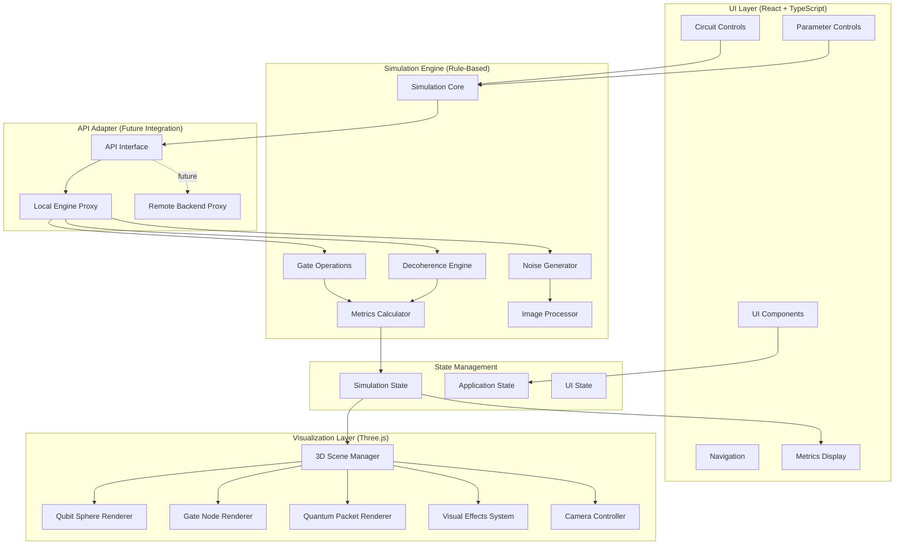

# Design Document: Quantum Fragility Visual Simulator

## Overview

The Quantum Fragility Visual Simulator is an educational web application that teaches undergraduate students about quantum system fragility through interactive 3D visualization. The system uses a rule-based, probability-driven mock simulation engine that treats quantum information as visual data (images) that progressively degrades when exposed to quantum operations and environmental noise.

### Core Design Philosophy

This is NOT a real quantum physics simulator. Instead, it's an educational tool that uses visual metaphors and probabilistic rules to approximate quantum behavior in a way that builds intuitive understanding. The design prioritizes:

1. **Visual intuition over mathematical accuracy**: Students learn by observing behavior, not solving equations
2. **Immediate feedback**: Every interaction produces visible changes in the 3D visualization
3. **Progressive degradation**: Quantum information visibly deteriorates through operations and time
4. **Educational clarity**: Each phenomenon is explained in student-friendly language

### Key Technical Approach

- **Browser-based execution**: All simulation runs client-side using JavaScript/TypeScript
- **Image-as-quantum-data**: User-uploaded images serve as the "quantum information" that degrades
- **Rule-based simulation**: Probabilistic transformations approximate quantum behavior
- **Three.js visualization**: Real-time 3D rendering of quantum states and operations
- **Modular architecture**: Clear separation between UI, visualization, simulation, and future API layers


## Architecture

### System Architecture Diagram



### Architectural Layers

#### 1. UI Layer (React + TypeScript)
Responsible for user interaction, navigation, and control interfaces.

**Components:**
- Page components (Home, Simulator, Learn, About)
- Navigation bar with routing
- Circuit builder controls (add/remove gates)
- Simulation controls (play, pause, reset, step)
- Parameter adjustment controls (noise, decoherence, gate errors)
- Real-time metrics display panels
- Educational explanation panels

**Technology:** Next.js App Router, React 18+, TypeScript, shadcn/ui, Framer Motion

#### 2. Visualization Layer (Three.js)
Responsible for 3D rendering of quantum states, operations, and effects.

**Components:**
- Scene manager: orchestrates all 3D objects and animations
- Qubit sphere renderer: glowing spheres with superposition effects
- Gate node renderer: 3D gate objects in circuit sequence
- Quantum packet renderer: moving image-based quantum data
- Visual effects system: particles, glows, fading, glitching
- Camera controller: user-controlled view manipulation

**Technology:** Three.js, React Three Fiber (@react-three/fiber), drei helpers

#### 3. Simulation Engine (Rule-Based)
Responsible for probabilistic quantum behavior simulation.

**Components:**
- Simulation core: orchestrates step-by-step execution
- Gate operations: applies probabilistic transformations per gate type
- Decoherence engine: continuous time-based degradation
- Noise generator: random disturbances
- Metrics calculator: computes coherence, entanglement, fidelity
- Image processor: applies visual corruption to quantum packet

**Technology:** TypeScript, Canvas API for image manipulation

#### 4. API Adapter (Future Integration)
Provides abstraction for swapping local simulation with remote backend.

**Components:**
- API interface: defines simulation operation contracts
- Local engine proxy: routes to browser-based simulation
- Remote backend proxy: (future) routes to server-based simulation

**Technology:** TypeScript interfaces, async/await patterns


## Components and Interfaces

### UI Layer Components

#### Page Components

```typescript
// app/page.tsx - Home Page
interface HomePageProps {}
// Displays introduction to quantum fragility with navigation to simulator

// app/simulator/page.tsx - Simulator Page
interface SimulatorPageProps {}
// Main interactive simulation interface

// app/learn/page.tsx - Learn Page
interface LearnPageProps {}
// Educational content about quantum concepts

// app/about/page.tsx - About Page
interface AboutPageProps {}
// Project purpose and methodology
```

#### Circuit Builder Components

```typescript
// components/circuit/CircuitBuilder.tsx
interface CircuitBuilderProps {
  circuit: Circuit;
  onAddGate: (gateType: GateType, qubitIndices: number[]) => void;
  onRemoveGate: (gateId: string) => void;
  onQubitCountChange: (count: number) => void;
}

// components/circuit/GateSelector.tsx
interface GateSelectorProps {
  availableGates: GateType[];
  onSelectGate: (gateType: GateType) => void;
}

// components/circuit/CircuitDisplay.tsx
interface CircuitDisplayProps {
  circuit: Circuit;
  currentGateIndex: number;
  onGateClick: (gateId: string) => void;
}
```

#### Simulation Control Components

```typescript
// components/controls/SimulationControls.tsx
interface SimulationControlsProps {
  isRunning: boolean;
  isPaused: boolean;
  onPlay: () => void;
  onPause: () => void;
  onReset: () => void;
  onStep: () => void;
}

// components/controls/ParameterControls.tsx
interface ParameterControlsProps {
  parameters: SimulationParameters;
  onParameterChange: (param: keyof SimulationParameters, value: number) => void;
}

// components/controls/ImageUpload.tsx
interface ImageUploadProps {
  onImageUpload: (imageData: ImageData) => void;
  onError: (error: string) => void;
}
```

#### Metrics Display Components

```typescript
// components/metrics/MetricsPanel.tsx
interface MetricsPanelProps {
  coherence: number;
  entanglement: number;
  gateFidelity: number;
  thresholds: MetricThresholds;
}

// components/metrics/MetricGauge.tsx
interface MetricGaugeProps {
  label: string;
  value: number;
  min: number;
  max: number;
  threshold?: number;
  unit?: string;
}
```

#### Educational Components

```typescript
// components/education/ExplanationPanel.tsx
interface ExplanationPanelProps {
  currentEvent: SimulationEvent;
  explanations: ExplanationMap;
}

// components/education/ConceptTooltip.tsx
interface ConceptTooltipProps {
  concept: QuantumConcept;
  children: React.ReactNode;
}
```

### Visualization Layer Components

#### Three.js Scene Components

```typescript
// components/visualization/QuantumScene.tsx
interface QuantumSceneProps {
  simulationState: SimulationState;
  onCameraChange?: (camera: Camera) => void;
}

// components/visualization/QubitSphere.tsx
interface QubitSphereProps {
  position: Vector3;
  state: QubitState;
  isInSuperposition: boolean;
  coherence: number;
}

// components/visualization/GateNode.tsx
interface GateNodeProps {
  position: Vector3;
  gateType: GateType;
  isActive: boolean;
  fidelity: number;
}

// components/visualization/QuantumPacket.tsx
interface QuantumPacketProps {
  position: Vector3;
  imageData: ImageData;
  degradation: number;
}

// components/visualization/EntanglementConnection.tsx
interface EntanglementConnectionProps {
  qubit1Position: Vector3;
  qubit2Position: Vector3;
  strength: number;
}

// components/visualization/NoiseParticles.tsx
interface NoiseParticlesProps {
  intensity: number;
  bounds: Box3;
}
```

### Simulation Engine Interfaces

#### Core Simulation Interface

```typescript
// lib/simulation/types.ts

interface ISimulationEngine {
  initialize(config: SimulationConfig): void;
  loadQuantumPacket(imageData: ImageData): void;
  buildCircuit(gates: GateDefinition[]): void;
  step(): SimulationStepResult;
  run(): AsyncGenerator<SimulationStepResult>;
  pause(): void;
  resume(): void;
  reset(): void;
  getState(): SimulationState;
}

interface SimulationConfig {
  qubitCount: number;
  noiseLevel: number;
  decoherenceRate: number;
  gateErrorProbability: number;
}

interface SimulationStepResult {
  state: SimulationState;
  event: SimulationEvent;
  metrics: SimulationMetrics;
  visualUpdates: VisualUpdate[];
}

interface SimulationState {
  qubits: QubitState[];
  quantumPacket: QuantumPacketState;
  circuit: Circuit;
  currentGateIndex: number;
  elapsedTime: number;
  isComplete: boolean;
}

interface QubitState {
  id: string;
  superpositionLevel: number; // 0-1
  entanglements: EntanglementLink[];
  coherence: number; // 0-1
}

interface QuantumPacketState {
  imageData: ImageData;
  degradationLevel: number; // 0-1
  position: number; // 0-1 along circuit
}

interface SimulationMetrics {
  coherence: number; // 0-1
  entanglement: number; // 0-1
  gateFidelity: number; // 0-1
}
```

#### Gate Operations Interface

```typescript
// lib/simulation/gates.ts

interface IGateOperation {
  apply(
    packet: QuantumPacketState,
    qubits: QubitState[],
    targetIndices: number[],
    errorProbability: number
  ): GateResult;
}

interface GateResult {
  updatedPacket: QuantumPacketState;
  updatedQubits: QubitState[];
  fidelity: number;
  visualEffects: VisualEffect[];
}

enum GateType {
  HADAMARD = 'hadamard',
  CNOT = 'cnot',
  PHASE = 'phase',
  IDENTITY = 'identity',
  MEASURE = 'measure'
}

interface GateDefinition {
  id: string;
  type: GateType;
  targetQubits: number[];
  controlQubits?: number[];
}
```

#### Decoherence and Noise Interfaces

```typescript
// lib/simulation/decoherence.ts

interface IDecoherenceEngine {
  apply(
    state: SimulationState,
    deltaTime: number,
    rate: number
  ): DecoherenceResult;
}

interface DecoherenceResult {
  coherenceLoss: number;
  packetDegradation: ImageCorruption;
  qubitFading: Map<string, number>;
}

// lib/simulation/noise.ts

interface INoiseGenerator {
  apply(
    state: SimulationState,
    intensity: number
  ): NoiseResult;
}

interface NoiseResult {
  packetDistortion: ImageCorruption;
  qubitInstability: Map<string, number>;
  visualParticles: ParticleEffect[];
}

interface ImageCorruption {
  type: 'blur' | 'pixelate' | 'colorShift' | 'fade';
  intensity: number;
  affectedRegions?: ImageRegion[];
}
```

### API Adapter Interface

```typescript
// lib/api/adapter.ts

interface ISimulationAdapter {
  initialize(config: SimulationConfig): Promise<void>;
  executeStep(): Promise<SimulationStepResult>;
  getState(): Promise<SimulationState>;
  reset(): Promise<void>;
}

// Local implementation
class LocalSimulationAdapter implements ISimulationAdapter {
  private engine: ISimulationEngine;
  
  async initialize(config: SimulationConfig): Promise<void> {
    this.engine.initialize(config);
  }
  
  async executeStep(): Promise<SimulationStepResult> {
    return this.engine.step();
  }
  
  // ... other methods
}

// Future remote implementation
class RemoteSimulationAdapter implements ISimulationAdapter {
  private apiClient: ApiClient;
  
  async initialize(config: SimulationConfig): Promise<void> {
    await this.apiClient.post('/simulation/initialize', config);
  }
  
  async executeStep(): Promise<SimulationStepResult> {
    return await this.apiClient.post('/simulation/step');
  }
  
  // ... other methods
}
```


## Data Models

### Core Data Structures

```typescript
// types/circuit.ts

interface Circuit {
  id: string;
  qubitCount: number;
  gates: Gate[];
  createdAt: Date;
}

interface Gate {
  id: string;
  type: GateType;
  targetQubits: number[];
  controlQubits?: number[];
  position: number; // sequence position
  errorProbability: number;
}

// types/quantum-state.ts

interface QuantumPacket {
  id: string;
  originalImage: ImageData;
  currentImage: ImageData;
  degradationHistory: DegradationSnapshot[];
  metadata: {
    width: number;
    height: number;
    format: string;
    uploadedAt: Date;
  };
}

interface DegradationSnapshot {
  timestamp: number;
  degradationLevel: number;
  appliedCorruptions: ImageCorruption[];
}

interface Qubit {
  id: string;
  index: number;
  state: {
    superposition: number; // 0 = definite, 1 = full superposition
    coherence: number; // 0 = fully decohered, 1 = fully coherent
    phase: number; // 0-2π for visualization
  };
  entanglements: Entanglement[];
  visualProperties: {
    position: Vector3;
    glowIntensity: number;
    pulseFrequency: number;
    color: Color;
  };
}

interface Entanglement {
  id: string;
  qubitIds: [string, string];
  strength: number; // 0-1
  createdAt: number;
  decayRate: number;
}

// types/metrics.ts

interface Metrics {
  coherence: MetricValue;
  entanglement: MetricValue;
  gateFidelity: MetricValue;
  timestamp: number;
}

interface MetricValue {
  current: number;
  min: number;
  max: number;
  history: number[];
  threshold?: number;
}

// types/simulation.ts

interface SimulationParameters {
  qubitCount: number; // 3-8
  noiseLevel: number; // 0-1
  decoherenceRate: number; // 0-1
  gateErrorProbability: number; // 0-1
  animationSpeed: number; // 0.1-2.0
}

interface SimulationEvent {
  type: EventType;
  timestamp: number;
  gateId?: string;
  qubitIds?: string[];
  description: string;
  educationalExplanation: string;
}

enum EventType {
  GATE_APPLIED = 'gate_applied',
  DECOHERENCE_TICK = 'decoherence_tick',
  NOISE_APPLIED = 'noise_applied',
  ENTANGLEMENT_FORMED = 'entanglement_formed',
  ENTANGLEMENT_BROKEN = 'entanglement_broken',
  SUPERPOSITION_ENTERED = 'superposition_entered',
  SUPERPOSITION_COLLAPSED = 'superposition_collapsed',
  MEASUREMENT_PERFORMED = 'measurement_performed',
  COHERENCE_THRESHOLD_CROSSED = 'coherence_threshold_crossed'
}

// types/visual.ts

interface VisualUpdate {
  type: VisualUpdateType;
  targetId: string;
  properties: Record<string, any>;
  animation?: AnimationConfig;
}

enum VisualUpdateType {
  QUBIT_STATE_CHANGE = 'qubit_state_change',
  PACKET_MOVE = 'packet_move',
  PACKET_DEGRADE = 'packet_degrade',
  GATE_ACTIVATE = 'gate_activate',
  GATE_DEACTIVATE = 'gate_deactivate',
  ENTANGLEMENT_SHOW = 'entanglement_show',
  ENTANGLEMENT_HIDE = 'entanglement_hide',
  NOISE_BURST = 'noise_burst',
  MEASUREMENT_COLLAPSE = 'measurement_collapse'
}

interface AnimationConfig {
  duration: number; // milliseconds
  easing: EasingFunction;
  delay?: number;
}

type EasingFunction = 'linear' | 'easeIn' | 'easeOut' | 'easeInOut' | 'bounce';
```

### State Management Structure

```typescript
// store/simulation-store.ts

interface ApplicationState {
  ui: UIState;
  simulation: SimulationState;
  visualization: VisualizationState;
}

interface UIState {
  currentPage: 'home' | 'simulator' | 'learn' | 'about';
  isSimulationRunning: boolean;
  isSimulationPaused: boolean;
  selectedGateType: GateType | null;
  showExplanations: boolean;
  showMetrics: boolean;
}

interface SimulationState {
  config: SimulationConfig;
  circuit: Circuit;
  quantumPacket: QuantumPacket | null;
  qubits: Qubit[];
  metrics: Metrics;
  currentGateIndex: number;
  elapsedTime: number;
  events: SimulationEvent[];
}

interface VisualizationState {
  camera: {
    position: Vector3;
    target: Vector3;
    zoom: number;
  };
  lighting: {
    ambient: number;
    directional: DirectionalLight[];
  };
  effects: {
    noiseParticles: ParticleSystem;
    glowIntensity: number;
  };
}
```


## Simulation Engine Algorithms

### Rule-Based Quantum Simulation

The simulation engine uses probabilistic rules to approximate quantum behavior. This is NOT real quantum physics - it's a visual metaphor system designed for education.

#### Image Processing as Quantum Data

```typescript
// lib/simulation/image-processor.ts

class ImageProcessor {
  /**
   * Converts uploaded image to quantum packet
   */
  createQuantumPacket(imageData: ImageData): QuantumPacket {
    return {
      id: generateId(),
      originalImage: cloneImageData(imageData),
      currentImage: cloneImageData(imageData),
      degradationHistory: [],
      metadata: {
        width: imageData.width,
        height: imageData.height,
        format: 'rgba',
        uploadedAt: new Date()
      }
    };
  }

  /**
   * Applies visual corruption to simulate quantum degradation
   */
  applyCorruption(
    imageData: ImageData,
    corruption: ImageCorruption
  ): ImageData {
    const canvas = document.createElement('canvas');
    const ctx = canvas.getContext('2d')!;
    canvas.width = imageData.width;
    canvas.height = imageData.height;
    ctx.putImageData(imageData, 0, 0);

    switch (corruption.type) {
      case 'blur':
        ctx.filter = `blur(${corruption.intensity * 10}px)`;
        break;
      case 'pixelate':
        this.applyPixelation(ctx, corruption.intensity);
        break;
      case 'colorShift':
        this.applyColorShift(ctx, corruption.intensity);
        break;
      case 'fade':
        ctx.globalAlpha = 1 - corruption.intensity;
        break;
    }

    ctx.drawImage(canvas, 0, 0);
    return ctx.getImageData(0, 0, canvas.width, canvas.height);
  }

  private applyPixelation(ctx: CanvasRenderingContext2D, intensity: number) {
    const pixelSize = Math.floor(1 + intensity * 20);
    const w = ctx.canvas.width;
    const h = ctx.canvas.height;
    
    ctx.imageSmoothingEnabled = false;
    ctx.drawImage(ctx.canvas, 0, 0, w / pixelSize, h / pixelSize);
    ctx.drawImage(ctx.canvas, 0, 0, w / pixelSize, h / pixelSize, 0, 0, w, h);
  }

  private applyColorShift(ctx: CanvasRenderingContext2D, intensity: number) {
    const imageData = ctx.getImageData(0, 0, ctx.canvas.width, ctx.canvas.height);
    const data = imageData.data;
    
    for (let i = 0; i < data.length; i += 4) {
      const shift = (Math.random() - 0.5) * intensity * 100;
      data[i] = Math.max(0, Math.min(255, data[i] + shift));     // R
      data[i + 1] = Math.max(0, Math.min(255, data[i + 1] + shift)); // G
      data[i + 2] = Math.max(0, Math.min(255, data[i + 2] + shift)); // B
    }
    
    ctx.putImageData(imageData, 0, 0);
  }
}
```

#### Gate Operation Algorithms

```typescript
// lib/simulation/gate-operations.ts

class GateOperations {
  /**
   * Hadamard gate: Creates superposition
   */
  applyHadamard(
    packet: QuantumPacketState,
    qubits: QubitState[],
    targetIndex: number,
    errorProb: number
  ): GateResult {
    const targetQubit = qubits[targetIndex];
    
    // Increase superposition level
    targetQubit.superpositionLevel = Math.min(1, targetQubit.superpositionLevel + 0.5);
    
    // Apply error with probability
    const actualError = Math.random() < errorProb ? Math.random() * 0.3 : 0;
    const fidelity = 1 - actualError;
    
    // Corrupt image based on error
    const corruption: ImageCorruption = {
      type: 'blur',
      intensity: actualError * 0.2
    };
    
    const updatedPacket = {
      ...packet,
      imageData: this.imageProcessor.applyCorruption(packet.imageData, corruption),
      degradationLevel: packet.degradationLevel + actualError * 0.1
    };
    
    return {
      updatedPacket,
      updatedQubits: qubits,
      fidelity,
      visualEffects: [
        { type: 'glow_pulse', targetId: targetQubit.id, intensity: 0.8 }
      ]
    };
  }

  /**
   * CNOT gate: Creates entanglement between qubits
   */
  applyCNOT(
    packet: QuantumPacketState,
    qubits: QubitState[],
    controlIndex: number,
    targetIndex: number,
    errorProb: number
  ): GateResult {
    const controlQubit = qubits[controlIndex];
    const targetQubit = qubits[targetIndex];
    
    // Create entanglement
    const entanglement: EntanglementLink = {
      id: generateId(),
      partnerId: targetQubit.id,
      strength: 0.8
    };
    controlQubit.entanglements.push(entanglement);
    targetQubit.entanglements.push({
      ...entanglement,
      partnerId: controlQubit.id
    });
    
    // Two-qubit gates have higher error rates
    const actualError = Math.random() < errorProb ? Math.random() * 0.5 : 0;
    const fidelity = 1 - actualError;
    
    // More severe corruption for multi-qubit gates
    const corruption: ImageCorruption = {
      type: 'pixelate',
      intensity: actualError * 0.3
    };
    
    const updatedPacket = {
      ...packet,
      imageData: this.imageProcessor.applyCorruption(packet.imageData, corruption),
      degradationLevel: packet.degradationLevel + actualError * 0.15
    };
    
    return {
      updatedPacket,
      updatedQubits: qubits,
      fidelity,
      visualEffects: [
        { type: 'entanglement_line', qubitIds: [controlQubit.id, targetQubit.id] }
      ]
    };
  }

  /**
   * Phase gate: Rotates quantum phase
   */
  applyPhase(
    packet: QuantumPacketState,
    qubits: QubitState[],
    targetIndex: number,
    errorProb: number
  ): GateResult {
    const targetQubit = qubits[targetIndex];
    
    // Rotate phase (visual only)
    // Phase is not directly visible but affects interference
    
    const actualError = Math.random() < errorProb ? Math.random() * 0.2 : 0;
    const fidelity = 1 - actualError;
    
    const corruption: ImageCorruption = {
      type: 'colorShift',
      intensity: actualError * 0.15
    };
    
    const updatedPacket = {
      ...packet,
      imageData: this.imageProcessor.applyCorruption(packet.imageData, corruption),
      degradationLevel: packet.degradationLevel + actualError * 0.08
    };
    
    return {
      updatedPacket,
      updatedQubits: qubits,
      fidelity,
      visualEffects: [
        { type: 'rotation', targetId: targetQubit.id, angle: Math.PI / 4 }
      ]
    };
  }

  /**
   * Identity gate: Does nothing (but still has errors!)
   */
  applyIdentity(
    packet: QuantumPacketState,
    qubits: QubitState[],
    targetIndex: number,
    errorProb: number
  ): GateResult {
    // Even "doing nothing" can introduce errors in real quantum systems
    const actualError = Math.random() < errorProb ? Math.random() * 0.1 : 0;
    const fidelity = 1 - actualError;
    
    const corruption: ImageCorruption = {
      type: 'fade',
      intensity: actualError * 0.05
    };
    
    const updatedPacket = actualError > 0 ? {
      ...packet,
      imageData: this.imageProcessor.applyCorruption(packet.imageData, corruption),
      degradationLevel: packet.degradationLevel + actualError * 0.05
    } : packet;
    
    return {
      updatedPacket,
      updatedQubits: qubits,
      fidelity,
      visualEffects: []
    };
  }

  /**
   * Measurement: Collapses superposition
   */
  applyMeasurement(
    packet: QuantumPacketState,
    qubits: QubitState[],
    targetIndex: number
  ): GateResult {
    const targetQubit = qubits[targetIndex];
    
    // Collapse superposition
    targetQubit.superpositionLevel = 0;
    targetQubit.coherence = 0;
    
    // Break all entanglements
    targetQubit.entanglements = [];
    
    // Severe degradation from measurement
    const corruption: ImageCorruption = {
      type: 'pixelate',
      intensity: 0.5
    };
    
    const updatedPacket = {
      ...packet,
      imageData: this.imageProcessor.applyCorruption(packet.imageData, corruption),
      degradationLevel: Math.min(1, packet.degradationLevel + 0.3)
    };
    
    return {
      updatedPacket,
      updatedQubits: qubits,
      fidelity: 1, // Measurement is always "accurate"
      visualEffects: [
        { type: 'collapse_flash', targetId: targetQubit.id }
      ]
    };
  }
}
```

#### Decoherence Algorithm

```typescript
// lib/simulation/decoherence-engine.ts

class DecoherenceEngine {
  /**
   * Applies continuous time-based degradation
   */
  apply(
    state: SimulationState,
    deltaTime: number,
    rate: number
  ): DecoherenceResult {
    const coherenceLoss = deltaTime * rate * 0.01;
    
    // Reduce coherence for all qubits
    const qubitFading = new Map<string, number>();
    state.qubits.forEach(qubit => {
      const newCoherence = Math.max(0, qubit.coherence - coherenceLoss);
      qubit.coherence = newCoherence;
      qubitFading.set(qubit.id, coherenceLoss);
      
      // Decay superposition
      if (qubit.superpositionLevel > 0) {
        qubit.superpositionLevel = Math.max(0, qubit.superpositionLevel - coherenceLoss * 0.5);
      }
      
      // Decay entanglements
      qubit.entanglements = qubit.entanglements.filter(ent => {
        ent.strength = Math.max(0, ent.strength - coherenceLoss * 0.3);
        return ent.strength > 0.1;
      });
    });
    
    // Degrade quantum packet
    const packetDegradation: ImageCorruption = {
      type: 'fade',
      intensity: coherenceLoss * 2
    };
    
    return {
      coherenceLoss,
      packetDegradation,
      qubitFading
    };
  }
}
```

#### Noise Generation Algorithm

```typescript
// lib/simulation/noise-generator.ts

class NoiseGenerator {
  /**
   * Applies random disturbances
   */
  apply(
    state: SimulationState,
    intensity: number
  ): NoiseResult {
    const qubitInstability = new Map<string, number>();
    
    // Random noise events
    state.qubits.forEach(qubit => {
      if (Math.random() < intensity * 0.1) {
        const disturbance = Math.random() * intensity * 0.2;
        qubit.coherence = Math.max(0, qubit.coherence - disturbance);
        qubitInstability.set(qubit.id, disturbance);
      }
    });
    
    // Random packet distortion
    const shouldDistort = Math.random() < intensity * 0.05;
    const packetDistortion: ImageCorruption | null = shouldDistort ? {
      type: Math.random() > 0.5 ? 'blur' : 'colorShift',
      intensity: Math.random() * intensity * 0.1
    } : null;
    
    // Generate visual particle effects
    const particleCount = Math.floor(intensity * 20);
    const visualParticles: ParticleEffect[] = Array.from({ length: particleCount }, () => ({
      position: {
        x: (Math.random() - 0.5) * 10,
        y: (Math.random() - 0.5) * 10,
        z: (Math.random() - 0.5) * 10
      },
      velocity: {
        x: (Math.random() - 0.5) * 0.1,
        y: (Math.random() - 0.5) * 0.1,
        z: (Math.random() - 0.5) * 0.1
      },
      lifetime: Math.random() * 2000
    }));
    
    return {
      packetDistortion,
      qubitInstability,
      visualParticles
    };
  }
}
```

#### Metrics Calculation

```typescript
// lib/simulation/metrics-calculator.ts

class MetricsCalculator {
  /**
   * Computes overall coherence metric
   */
  calculateCoherence(qubits: QubitState[]): number {
    if (qubits.length === 0) return 0;
    
    const avgCoherence = qubits.reduce((sum, q) => sum + q.coherence, 0) / qubits.length;
    return avgCoherence;
  }

  /**
   * Computes entanglement metric
   */
  calculateEntanglement(qubits: QubitState[]): number {
    const totalEntanglements = qubits.reduce((sum, q) => sum + q.entanglements.length, 0);
    const maxPossibleEntanglements = qubits.length * (qubits.length - 1) / 2;
    
    if (maxPossibleEntanglements === 0) return 0;
    
    const avgStrength = qubits.reduce((sum, q) => {
      return sum + q.entanglements.reduce((s, e) => s + e.strength, 0);
    }, 0) / Math.max(1, totalEntanglements);
    
    return (totalEntanglements / maxPossibleEntanglements) * avgStrength;
  }

  /**
   * Computes gate fidelity metric
   */
  calculateGateFidelity(recentGateResults: GateResult[]): number {
    if (recentGateResults.length === 0) return 1;
    
    const avgFidelity = recentGateResults.reduce((sum, r) => sum + r.fidelity, 0) / recentGateResults.length;
    return avgFidelity;
  }
}
```


## Visualization Rendering Pipeline

### Three.js Scene Setup

```typescript
// components/visualization/QuantumScene.tsx

import { Canvas } from '@react-three/fiber';
import { OrbitControls, PerspectiveCamera } from '@react-three/drei';

export function QuantumScene({ simulationState }: QuantumSceneProps) {
  return (
    <Canvas>
      {/* Camera */}
      <PerspectiveCamera makeDefault position={[0, 5, 10]} />
      <OrbitControls enableDamping dampingFactor={0.05} />
      
      {/* Lighting */}
      <ambientLight intensity={0.3} />
      <directionalLight position={[10, 10, 5]} intensity={0.5} />
      <pointLight position={[0, 5, 0]} intensity={0.3} color="#4080ff" />
      
      {/* Quantum Components */}
      <QubitArray qubits={simulationState.qubits} />
      <GateSequence gates={simulationState.circuit.gates} />
      <QuantumPacket packet={simulationState.quantumPacket} />
      <EntanglementConnections qubits={simulationState.qubits} />
      <NoiseParticles intensity={simulationState.config.noiseLevel} />
      
      {/* Environment */}
      <gridHelper args={[20, 20]} />
    </Canvas>
  );
}
```

### Qubit Sphere Rendering

```typescript
// components/visualization/QubitSphere.tsx

import { useRef } from 'react';
import { useFrame } from '@react-three/fiber';
import { Sphere } from '@react-three/drei';
import * as THREE from 'three';

export function QubitSphere({ position, state, isInSuperposition, coherence }: QubitSphereProps) {
  const meshRef = useRef<THREE.Mesh>(null);
  const glowRef = useRef<THREE.Mesh>(null);
  
  // Animate superposition pulsing
  useFrame(({ clock }) => {
    if (!meshRef.current || !glowRef.current) return;
    
    if (isInSuperposition) {
      const pulse = Math.sin(clock.getElapsedTime() * 3) * 0.5 + 0.5;
      const scale = 1 + state.superpositionLevel * pulse * 0.3;
      meshRef.current.scale.setScalar(scale);
      
      // Glow intensity
      const glowIntensity = state.superpositionLevel * (0.5 + pulse * 0.5);
      glowRef.current.scale.setScalar(1.5 + glowIntensity);
    }
    
    // Fade based on coherence
    meshRef.current.material.opacity = 0.3 + coherence * 0.7;
  });
  
  return (
    <group position={position}>
      {/* Main sphere */}
      <Sphere ref={meshRef} args={[0.3, 32, 32]}>
        <meshStandardMaterial
          color={isInSuperposition ? '#4080ff' : '#8080ff'}
          emissive={isInSuperposition ? '#2040ff' : '#000000'}
          emissiveIntensity={state.superpositionLevel}
          transparent
          opacity={0.3 + coherence * 0.7}
        />
      </Sphere>
      
      {/* Glow effect */}
      {isInSuperposition && (
        <Sphere ref={glowRef} args={[0.4, 16, 16]}>
          <meshBasicMaterial
            color="#4080ff"
            transparent
            opacity={state.superpositionLevel * 0.3}
            side={THREE.BackSide}
          />
        </Sphere>
      )}
    </group>
  );
}
```

### Gate Node Rendering

```typescript
// components/visualization/GateNode.tsx

import { Box, Text } from '@react-three/drei';
import { useFrame } from '@react-three/fiber';
import { useRef } from 'react';
import * as THREE from 'three';

export function GateNode({ position, gateType, isActive, fidelity }: GateNodeProps) {
  const meshRef = useRef<THREE.Mesh>(null);
  
  useFrame(() => {
    if (!meshRef.current) return;
    
    // Pulse when active
    if (isActive) {
      meshRef.current.rotation.y += 0.02;
    }
  });
  
  const gateColor = getGateColor(gateType);
  const gateLabel = getGateLabel(gateType);
  
  return (
    <group position={position}>
      <Box ref={meshRef} args={[1, 1, 0.2]}>
        <meshStandardMaterial
          color={gateColor}
          emissive={isActive ? gateColor : '#000000'}
          emissiveIntensity={isActive ? 0.5 : 0}
          opacity={0.5 + fidelity * 0.5}
          transparent
        />
      </Box>
      
      <Text
        position={[0, 0, 0.15]}
        fontSize={0.3}
        color="white"
        anchorX="center"
        anchorY="middle"
      >
        {gateLabel}
      </Text>
    </group>
  );
}

function getGateColor(type: GateType): string {
  switch (type) {
    case GateType.HADAMARD: return '#ff6b6b';
    case GateType.CNOT: return '#4ecdc4';
    case GateType.PHASE: return '#ffe66d';
    case GateType.IDENTITY: return '#95e1d3';
    case GateType.MEASURE: return '#f38181';
    default: return '#ffffff';
  }
}

function getGateLabel(type: GateType): string {
  switch (type) {
    case GateType.HADAMARD: return 'H';
    case GateType.CNOT: return 'CNOT';
    case GateType.PHASE: return 'P';
    case GateType.IDENTITY: return 'I';
    case GateType.MEASURE: return 'M';
    default: return '?';
  }
}
```

### Quantum Packet Rendering

```typescript
// components/visualization/QuantumPacket.tsx

import { useRef, useMemo } from 'react';
import { useFrame, useLoader } from '@react-three/fiber';
import * as THREE from 'three';

export function QuantumPacket({ position, imageData, degradation }: QuantumPacketProps) {
  const meshRef = useRef<THREE.Mesh>(null);
  
  // Create texture from image data
  const texture = useMemo(() => {
    const canvas = document.createElement('canvas');
    canvas.width = imageData.width;
    canvas.height = imageData.height;
    const ctx = canvas.getContext('2d')!;
    ctx.putImageData(imageData, 0, 0);
    
    const tex = new THREE.CanvasTexture(canvas);
    tex.needsUpdate = true;
    return tex;
  }, [imageData]);
  
  useFrame(({ clock }) => {
    if (!meshRef.current) return;
    
    // Gentle floating animation
    meshRef.current.position.y = position.y + Math.sin(clock.getElapsedTime()) * 0.1;
    
    // Glitch effect when highly degraded
    if (degradation > 0.7) {
      const glitch = Math.random() * 0.05;
      meshRef.current.position.x += (Math.random() - 0.5) * glitch;
      meshRef.current.position.z += (Math.random() - 0.5) * glitch;
    }
  });
  
  return (
    <mesh ref={meshRef} position={position}>
      <planeGeometry args={[2, 2]} />
      <meshBasicMaterial
        map={texture}
        transparent
        opacity={1 - degradation * 0.5}
        side={THREE.DoubleSide}
      />
    </mesh>
  );
}
```

### Entanglement Connection Rendering

```typescript
// components/visualization/EntanglementConnection.tsx

import { useRef } from 'react';
import { useFrame } from '@react-three/fiber';
import { Line } from '@react-three/drei';
import * as THREE from 'three';

export function EntanglementConnection({
  qubit1Position,
  qubit2Position,
  strength
}: EntanglementConnectionProps) {
  const lineRef = useRef<THREE.Line>(null);
  
  useFrame(({ clock }) => {
    if (!lineRef.current) return;
    
    // Animate line opacity
    const pulse = Math.sin(clock.getElapsedTime() * 2) * 0.5 + 0.5;
    (lineRef.current.material as THREE.LineBasicMaterial).opacity = strength * (0.3 + pulse * 0.4);
  });
  
  const points = [qubit1Position, qubit2Position];
  
  return (
    <Line
      ref={lineRef}
      points={points}
      color="#ff00ff"
      lineWidth={2}
      transparent
      opacity={strength * 0.5}
    />
  );
}
```

### Noise Particle System

```typescript
// components/visualization/NoiseParticles.tsx

import { useRef, useMemo } from 'react';
import { useFrame } from '@react-three/fiber';
import * as THREE from 'three';

export function NoiseParticles({ intensity, bounds }: NoiseParticlesProps) {
  const particlesRef = useRef<THREE.Points>(null);
  
  const particleCount = Math.floor(intensity * 1000);
  
  const { positions, velocities } = useMemo(() => {
    const pos = new Float32Array(particleCount * 3);
    const vel = new Float32Array(particleCount * 3);
    
    for (let i = 0; i < particleCount; i++) {
      const i3 = i * 3;
      pos[i3] = (Math.random() - 0.5) * 20;
      pos[i3 + 1] = (Math.random() - 0.5) * 20;
      pos[i3 + 2] = (Math.random() - 0.5) * 20;
      
      vel[i3] = (Math.random() - 0.5) * 0.02;
      vel[i3 + 1] = (Math.random() - 0.5) * 0.02;
      vel[i3 + 2] = (Math.random() - 0.5) * 0.02;
    }
    
    return { positions: pos, velocities: vel };
  }, [particleCount]);
  
  useFrame(() => {
    if (!particlesRef.current) return;
    
    const pos = particlesRef.current.geometry.attributes.position.array as Float32Array;
    
    for (let i = 0; i < particleCount; i++) {
      const i3 = i * 3;
      pos[i3] += velocities[i3];
      pos[i3 + 1] += velocities[i3 + 1];
      pos[i3 + 2] += velocities[i3 + 2];
      
      // Wrap around bounds
      if (Math.abs(pos[i3]) > 10) pos[i3] *= -1;
      if (Math.abs(pos[i3 + 1]) > 10) pos[i3 + 1] *= -1;
      if (Math.abs(pos[i3 + 2]) > 10) pos[i3 + 2] *= -1;
    }
    
    particlesRef.current.geometry.attributes.position.needsUpdate = true;
  });
  
  return (
    <points ref={particlesRef}>
      <bufferGeometry>
        <bufferAttribute
          attach="attributes-position"
          count={particleCount}
          array={positions}
          itemSize={3}
        />
      </bufferGeometry>
      <pointsMaterial
        size={0.05}
        color="#ff0000"
        transparent
        opacity={intensity * 0.3}
        sizeAttenuation
      />
    </points>
  );
}
```

### Animation System

```typescript
// lib/animation/animation-controller.ts

class AnimationController {
  private activeAnimations: Map<string, Animation> = new Map();
  
  /**
   * Triggers visual animation based on simulation event
   */
  triggerAnimation(update: VisualUpdate): void {
    switch (update.type) {
      case VisualUpdateType.GATE_ACTIVATE:
        this.animateGateActivation(update.targetId, update.animation);
        break;
      case VisualUpdateType.PACKET_MOVE:
        this.animatePacketMovement(update.targetId, update.properties, update.animation);
        break;
      case VisualUpdateType.MEASUREMENT_COLLAPSE:
        this.animateMeasurementCollapse(update.targetId, update.animation);
        break;
      // ... other animation types
    }
  }
  
  private animateGateActivation(gateId: string, config?: AnimationConfig): void {
    // Trigger gate glow and rotation animation
    // Implementation uses Framer Motion or Three.js animation
  }
  
  private animatePacketMovement(
    packetId: string,
    properties: { targetPosition: Vector3 },
    config?: AnimationConfig
  ): void {
    // Smooth movement of quantum packet through circuit
  }
  
  private animateMeasurementCollapse(qubitId: string, config?: AnimationConfig): void {
    // Flash effect followed by fade of superposition indicators
  }
}
```


## State Management Approach

### React State Management with Zustand

```typescript
// store/use-simulation-store.ts

import { create } from 'zustand';
import { devtools } from 'zustand/middleware';

interface SimulationStore {
  // State
  config: SimulationConfig;
  circuit: Circuit;
  quantumPacket: QuantumPacket | null;
  qubits: Qubit[];
  metrics: Metrics;
  currentGateIndex: number;
  isRunning: boolean;
  isPaused: boolean;
  events: SimulationEvent[];
  
  // Actions
  setConfig: (config: Partial<SimulationConfig>) => void;
  uploadImage: (imageData: ImageData) => void;
  addGate: (gateType: GateType, targetQubits: number[]) => void;
  removeGate: (gateId: string) => void;
  startSimulation: () => void;
  pauseSimulation: () => void;
  resumeSimulation: () => void;
  resetSimulation: () => void;
  stepSimulation: () => void;
  updateSimulationState: (result: SimulationStepResult) => void;
}

export const useSimulationStore = create<SimulationStore>()(
  devtools(
    (set, get) => ({
      // Initial state
      config: {
        qubitCount: 3,
        noiseLevel: 0.3,
        decoherenceRate: 0.2,
        gateErrorProbability: 0.1,
        animationSpeed: 1.0
      },
      circuit: { id: generateId(), qubitCount: 3, gates: [], createdAt: new Date() },
      quantumPacket: null,
      qubits: [],
      metrics: createInitialMetrics(),
      currentGateIndex: 0,
      isRunning: false,
      isPaused: false,
      events: [],
      
      // Actions
      setConfig: (config) => set((state) => ({
        config: { ...state.config, ...config }
      })),
      
      uploadImage: (imageData) => {
        const processor = new ImageProcessor();
        const packet = processor.createQuantumPacket(imageData);
        set({ quantumPacket: packet });
      },
      
      addGate: (gateType, targetQubits) => set((state) => {
        const newGate: Gate = {
          id: generateId(),
          type: gateType,
          targetQubits,
          position: state.circuit.gates.length,
          errorProbability: state.config.gateErrorProbability
        };
        return {
          circuit: {
            ...state.circuit,
            gates: [...state.circuit.gates, newGate]
          }
        };
      }),
      
      removeGate: (gateId) => set((state) => ({
        circuit: {
          ...state.circuit,
          gates: state.circuit.gates.filter(g => g.id !== gateId)
        }
      })),
      
      startSimulation: () => {
        const state = get();
        if (!state.quantumPacket) {
          console.error('No quantum packet loaded');
          return;
        }
        
        // Initialize qubits
        const qubits = initializeQubits(state.config.qubitCount);
        set({ qubits, isRunning: true, isPaused: false, currentGateIndex: 0 });
        
        // Start simulation loop
        runSimulationLoop();
      },
      
      pauseSimulation: () => set({ isPaused: true }),
      
      resumeSimulation: () => set({ isPaused: false }),
      
      resetSimulation: () => set({
        currentGateIndex: 0,
        isRunning: false,
        isPaused: false,
        qubits: [],
        events: [],
        metrics: createInitialMetrics()
      }),
      
      stepSimulation: () => {
        const state = get();
        if (state.currentGateIndex >= state.circuit.gates.length) {
          set({ isRunning: false });
          return;
        }
        
        // Execute single step
        const engine = getSimulationEngine();
        const result = engine.step();
        get().updateSimulationState(result);
      },
      
      updateSimulationState: (result) => set((state) => ({
        qubits: result.state.qubits,
        quantumPacket: result.state.quantumPacket,
        metrics: result.metrics,
        currentGateIndex: result.state.currentGateIndex,
        events: [...state.events, result.event]
      }))
    }),
    { name: 'simulation-store' }
  )
);

// Simulation loop
async function runSimulationLoop() {
  const store = useSimulationStore.getState();
  
  while (store.isRunning && !store.isPaused) {
    if (store.currentGateIndex >= store.circuit.gates.length) {
      store.resetSimulation();
      break;
    }
    
    store.stepSimulation();
    
    // Wait for animation
    await new Promise(resolve => 
      setTimeout(resolve, 1000 / store.config.animationSpeed)
    );
  }
}

function initializeQubits(count: number): Qubit[] {
  return Array.from({ length: count }, (_, i) => ({
    id: generateId(),
    index: i,
    state: {
      superposition: 0,
      coherence: 1,
      phase: 0
    },
    entanglements: [],
    visualProperties: {
      position: new THREE.Vector3(i * 2 - count, 0, 0),
      glowIntensity: 0,
      pulseFrequency: 1,
      color: new THREE.Color('#4080ff')
    }
  }));
}

function createInitialMetrics(): Metrics {
  return {
    coherence: { current: 1, min: 0, max: 1, history: [1] },
    entanglement: { current: 0, min: 0, max: 1, history: [0] },
    gateFidelity: { current: 1, min: 0, max: 1, history: [1] },
    timestamp: Date.now()
  };
}
```

### UI State Management

```typescript
// store/use-ui-store.ts

import { create } from 'zustand';

interface UIStore {
  currentPage: 'home' | 'simulator' | 'learn' | 'about';
  showExplanations: boolean;
  showMetrics: boolean;
  selectedGateType: GateType | null;
  cameraPosition: Vector3;
  
  setCurrentPage: (page: UIStore['currentPage']) => void;
  toggleExplanations: () => void;
  toggleMetrics: () => void;
  selectGateType: (type: GateType | null) => void;
  setCameraPosition: (position: Vector3) => void;
}

export const useUIStore = create<UIStore>((set) => ({
  currentPage: 'home',
  showExplanations: true,
  showMetrics: true,
  selectedGateType: null,
  cameraPosition: new THREE.Vector3(0, 5, 10),
  
  setCurrentPage: (page) => set({ currentPage: page }),
  toggleExplanations: () => set((state) => ({ showExplanations: !state.showExplanations })),
  toggleMetrics: () => set((state) => ({ showMetrics: !state.showMetrics })),
  selectGateType: (type) => set({ selectedGateType: type }),
  setCameraPosition: (position) => set({ cameraPosition: position })
}));
```


## API Adapter Interface

### Adapter Pattern for Future Backend Integration

The API Adapter provides a clean abstraction layer that allows swapping between local browser-based simulation and future remote backend simulation without changing application code.

```typescript
// lib/api/simulation-adapter.ts

/**
 * Abstract interface for simulation execution
 */
export interface ISimulationAdapter {
  initialize(config: SimulationConfig): Promise<void>;
  loadQuantumPacket(imageData: ImageData): Promise<string>;
  buildCircuit(gates: GateDefinition[]): Promise<void>;
  executeStep(): Promise<SimulationStepResult>;
  executeAll(): AsyncGenerator<SimulationStepResult>;
  pause(): Promise<void>;
  resume(): Promise<void>;
  reset(): Promise<void>;
  getState(): Promise<SimulationState>;
  getMetrics(): Promise<SimulationMetrics>;
}

/**
 * Local browser-based implementation
 */
export class LocalSimulationAdapter implements ISimulationAdapter {
  private engine: SimulationEngine;
  
  constructor() {
    this.engine = new SimulationEngine();
  }
  
  async initialize(config: SimulationConfig): Promise<void> {
    this.engine.initialize(config);
  }
  
  async loadQuantumPacket(imageData: ImageData): Promise<string> {
    const processor = new ImageProcessor();
    const packet = processor.createQuantumPacket(imageData);
    this.engine.loadPacket(packet);
    return packet.id;
  }
  
  async buildCircuit(gates: GateDefinition[]): Promise<void> {
    this.engine.buildCircuit(gates);
  }
  
  async executeStep(): Promise<SimulationStepResult> {
    return this.engine.step();
  }
  
  async *executeAll(): AsyncGenerator<SimulationStepResult> {
    while (!this.engine.isComplete()) {
      yield this.engine.step();
    }
  }
  
  async pause(): Promise<void> {
    this.engine.pause();
  }
  
  async resume(): Promise<void> {
    this.engine.resume();
  }
  
  async reset(): Promise<void> {
    this.engine.reset();
  }
  
  async getState(): Promise<SimulationState> {
    return this.engine.getState();
  }
  
  async getMetrics(): Promise<SimulationMetrics> {
    return this.engine.getMetrics();
  }
}

/**
 * Remote backend implementation (future)
 */
export class RemoteSimulationAdapter implements ISimulationAdapter {
  private apiClient: ApiClient;
  private sessionId: string | null = null;
  
  constructor(baseUrl: string) {
    this.apiClient = new ApiClient(baseUrl);
  }
  
  async initialize(config: SimulationConfig): Promise<void> {
    const response = await this.apiClient.post<{ sessionId: string }>(
      '/simulation/initialize',
      config
    );
    this.sessionId = response.sessionId;
  }
  
  async loadQuantumPacket(imageData: ImageData): Promise<string> {
    // Convert ImageData to base64 for transmission
    const base64 = imageDataToBase64(imageData);
    
    const response = await this.apiClient.post<{ packetId: string }>(
      `/simulation/${this.sessionId}/packet`,
      { imageData: base64 }
    );
    
    return response.packetId;
  }
  
  async buildCircuit(gates: GateDefinition[]): Promise<void> {
    await this.apiClient.post(
      `/simulation/${this.sessionId}/circuit`,
      { gates }
    );
  }
  
  async executeStep(): Promise<SimulationStepResult> {
    return await this.apiClient.post<SimulationStepResult>(
      `/simulation/${this.sessionId}/step`
    );
  }
  
  async *executeAll(): AsyncGenerator<SimulationStepResult> {
    let isComplete = false;
    
    while (!isComplete) {
      const result = await this.executeStep();
      yield result;
      isComplete = result.state.isComplete;
    }
  }
  
  async pause(): Promise<void> {
    await this.apiClient.post(`/simulation/${this.sessionId}/pause`);
  }
  
  async resume(): Promise<void> {
    await this.apiClient.post(`/simulation/${this.sessionId}/resume`);
  }
  
  async reset(): Promise<void> {
    await this.apiClient.post(`/simulation/${this.sessionId}/reset`);
  }
  
  async getState(): Promise<SimulationState> {
    return await this.apiClient.get<SimulationState>(
      `/simulation/${this.sessionId}/state`
    );
  }
  
  async getMetrics(): Promise<SimulationMetrics> {
    return await this.apiClient.get<SimulationMetrics>(
      `/simulation/${this.sessionId}/metrics`
    );
  }
}

/**
 * Factory for creating appropriate adapter
 */
export class SimulationAdapterFactory {
  static create(mode: 'local' | 'remote', config?: { apiUrl?: string }): ISimulationAdapter {
    switch (mode) {
      case 'local':
        return new LocalSimulationAdapter();
      case 'remote':
        if (!config?.apiUrl) {
          throw new Error('API URL required for remote adapter');
        }
        return new RemoteSimulationAdapter(config.apiUrl);
      default:
        throw new Error(`Unknown adapter mode: ${mode}`);
    }
  }
}

/**
 * Simple API client for HTTP requests
 */
class ApiClient {
  constructor(private baseUrl: string) {}
  
  async get<T>(endpoint: string): Promise<T> {
    const response = await fetch(`${this.baseUrl}${endpoint}`);
    if (!response.ok) {
      throw new Error(`API error: ${response.statusText}`);
    }
    return response.json();
  }
  
  async post<T>(endpoint: string, data?: any): Promise<T> {
    const response = await fetch(`${this.baseUrl}${endpoint}`, {
      method: 'POST',
      headers: { 'Content-Type': 'application/json' },
      body: data ? JSON.stringify(data) : undefined
    });
    if (!response.ok) {
      throw new Error(`API error: ${response.statusText}`);
    }
    return response.json();
  }
}

// Helper function
function imageDataToBase64(imageData: ImageData): string {
  const canvas = document.createElement('canvas');
  canvas.width = imageData.width;
  canvas.height = imageData.height;
  const ctx = canvas.getContext('2d')!;
  ctx.putImageData(imageData, 0, 0);
  return canvas.toDataURL('image/png').split(',')[1];
}
```

### Usage in Application

```typescript
// lib/simulation/simulation-service.ts

export class SimulationService {
  private adapter: ISimulationAdapter;
  
  constructor(mode: 'local' | 'remote' = 'local') {
    this.adapter = SimulationAdapterFactory.create(mode, {
      apiUrl: process.env.NEXT_PUBLIC_API_URL
    });
  }
  
  // All simulation operations go through adapter
  async initialize(config: SimulationConfig): Promise<void> {
    await this.adapter.initialize(config);
  }
  
  async loadImage(imageData: ImageData): Promise<string> {
    return await this.adapter.loadQuantumPacket(imageData);
  }
  
  async buildCircuit(gates: GateDefinition[]): Promise<void> {
    await this.adapter.buildCircuit(gates);
  }
  
  async step(): Promise<SimulationStepResult> {
    return await this.adapter.executeStep();
  }
  
  // ... other methods
}
```


## File and Folder Structure

```
quantum-fragility-simulator/
├── app/                                    # Next.js App Router
│   ├── layout.tsx                          # Root layout with navigation
│   ├── page.tsx                            # Home page
│   ├── simulator/
│   │   └── page.tsx                        # Simulator page
│   ├── learn/
│   │   └── page.tsx                        # Learn page
│   ├── about/
│   │   └── page.tsx                        # About page
│   └── globals.css                         # Global styles
│
├── components/                             # React components
│   ├── layout/
│   │   ├── Navigation.tsx                  # Navigation bar
│   │   └── Footer.tsx                      # Footer
│   │
│   ├── circuit/
│   │   ├── CircuitBuilder.tsx              # Circuit construction UI
│   │   ├── CircuitDisplay.tsx              # Visual circuit representation
│   │   ├── GateSelector.tsx                # Gate selection controls
│   │   └── QubitSelector.tsx               # Qubit count selector
│   │
│   ├── controls/
│   │   ├── SimulationControls.tsx          # Play/pause/reset buttons
│   │   ├── ParameterControls.tsx           # Noise/decoherence sliders
│   │   └── ImageUpload.tsx                 # Image upload component
│   │
│   ├── metrics/
│   │   ├── MetricsPanel.tsx                # Metrics display container
│   │   ├── MetricGauge.tsx                 # Individual metric gauge
│   │   └── MetricsChart.tsx                # Historical metrics chart
│   │
│   ├── education/
│   │   ├── ExplanationPanel.tsx            # Educational explanations
│   │   ├── ConceptTooltip.tsx              # Hover tooltips
│   │   └── GlossaryModal.tsx               # Glossary popup
│   │
│   ├── visualization/
│   │   ├── QuantumScene.tsx                # Main Three.js scene
│   │   ├── QubitSphere.tsx                 # Qubit sphere renderer
│   │   ├── GateNode.tsx                    # Gate node renderer
│   │   ├── QuantumPacket.tsx               # Quantum packet renderer
│   │   ├── EntanglementConnection.tsx      # Entanglement line renderer
│   │   ├── NoiseParticles.tsx              # Noise particle system
│   │   └── CameraController.tsx            # Camera controls
│   │
│   └── ui/                                 # shadcn/ui components
│       ├── button.tsx
│       ├── slider.tsx
│       ├── card.tsx
│       └── ...                             # Other shadcn components
│
├── lib/                                    # Core logic
│   ├── simulation/
│   │   ├── simulation-engine.ts            # Main simulation engine
│   │   ├── gate-operations.ts              # Gate operation implementations
│   │   ├── decoherence-engine.ts           # Decoherence logic
│   │   ├── noise-generator.ts              # Noise generation
│   │   ├── metrics-calculator.ts           # Metrics computation
│   │   ├── image-processor.ts              # Image manipulation
│   │   └── types.ts                        # Simulation type definitions
│   │
│   ├── api/
│   │   ├── simulation-adapter.ts           # Adapter interface
│   │   ├── local-adapter.ts                # Local implementation
│   │   └── remote-adapter.ts               # Remote implementation (future)
│   │
│   ├── animation/
│   │   ├── animation-controller.ts         # Animation orchestration
│   │   └── easing-functions.ts             # Easing utilities
│   │
│   └── utils/
│       ├── id-generator.ts                 # Unique ID generation
│       ├── vector-math.ts                  # Vector utilities
│       └── color-utils.ts                  # Color manipulation
│
├── store/                                  # State management
│   ├── use-simulation-store.ts             # Simulation state (Zustand)
│   └── use-ui-store.ts                     # UI state (Zustand)
│
├── types/                                  # TypeScript types
│   ├── circuit.ts                          # Circuit types
│   ├── quantum-state.ts                    # Quantum state types
│   ├── metrics.ts                          # Metrics types
│   ├── simulation.ts                       # Simulation types
│   └── visual.ts                           # Visualization types
│
├── content/                                # Educational content
│   ├── explanations.ts                     # Event explanations
│   ├── glossary.ts                         # Quantum concept glossary
│   └── learn-content.md                    # Learn page content
│
├── public/                                 # Static assets
│   ├── images/
│   │   └── sample-quantum-data.png         # Sample image for testing
│   └── fonts/
│
├── styles/                                 # Additional styles
│   └── visualization.css                   # Three.js specific styles
│
├── tests/                                  # Test files
│   ├── unit/
│   │   ├── gate-operations.test.ts
│   │   ├── decoherence-engine.test.ts
│   │   ├── metrics-calculator.test.ts
│   │   └── image-processor.test.ts
│   │
│   └── integration/
│       ├── simulation-flow.test.ts
│       └── circuit-execution.test.ts
│
├── .env.local                              # Environment variables
├── next.config.js                          # Next.js configuration
├── tailwind.config.ts                      # Tailwind CSS configuration
├── tsconfig.json                           # TypeScript configuration
├── package.json                            # Dependencies
└── README.md                               # Project documentation
```

### Key File Responsibilities

#### Application Entry Points
- `app/page.tsx`: Landing page with introduction and navigation
- `app/simulator/page.tsx`: Main simulator interface integrating all components
- `app/learn/page.tsx`: Educational content about quantum fragility
- `app/about/page.tsx`: Project information and methodology

#### Core Simulation Logic
- `lib/simulation/simulation-engine.ts`: Orchestrates step-by-step execution
- `lib/simulation/gate-operations.ts`: Implements probabilistic gate transformations
- `lib/simulation/decoherence-engine.ts`: Continuous time-based degradation
- `lib/simulation/noise-generator.ts`: Random disturbance generation
- `lib/simulation/image-processor.ts`: Visual corruption of quantum packet

#### Visualization Components
- `components/visualization/QuantumScene.tsx`: Three.js scene setup and orchestration
- `components/visualization/QubitSphere.tsx`: Animated qubit rendering with superposition effects
- `components/visualization/QuantumPacket.tsx`: Image-based quantum data visualization
- `components/visualization/NoiseParticles.tsx`: Environmental noise particle system

#### State Management
- `store/use-simulation-store.ts`: Central simulation state with Zustand
- `store/use-ui-store.ts`: UI-specific state (page, visibility, selections)

#### API Abstraction
- `lib/api/simulation-adapter.ts`: Interface for local/remote simulation
- `lib/api/local-adapter.ts`: Browser-based implementation
- `lib/api/remote-adapter.ts`: Future backend integration


## Correctness Properties

*A property is a characteristic or behavior that should hold true across all valid executions of a system—essentially, a formal statement about what the system should do. Properties serve as the bridge between human-readable specifications and machine-verifiable correctness guarantees.*

### Property Reflection

After analyzing all acceptance criteria, I identified the following redundancies and consolidations:

**Redundancy Analysis:**
- Properties 11.1, 11.2, 11.3 (display individual metrics) can be consolidated into one property about displaying all metrics
- Properties 8.1, 8.2 (glow and animation for superposition) can be combined into one comprehensive superposition visualization property
- Properties 9.1, 9.3 (entanglement connections display and maintenance) can be combined into one property
- Properties 15.1, 15.2, 15.3, 15.4 (outputting individual state components) can be consolidated into one property about complete state output
- Properties 6.1, 6.2 (coherence reduction and visual degradation) are closely related aspects of decoherence and can be combined
- Properties 7.2, 7.3 (noise distortions and visual instability) can be combined into one comprehensive noise effect property

**Consolidated Properties:**
The following properties represent unique, non-redundant validation requirements after consolidation.


### Property 1: Navigation Accessibility

*For any* page in the application, navigation controls should be present and accessible.

**Validates: Requirements 1.5**

### Property 2: Image Format Validation

*For any* file input, the application should accept only supported image formats and reject all other file types.

**Validates: Requirements 2.1, 2.4**

### Property 3: Image to Quantum Packet Conversion

*For any* valid image upload, the simulator engine should produce a quantum packet that preserves the visual characteristics of the original image.

**Validates: Requirements 2.2, 2.5**

### Property 4: Image Preview Display

*For any* uploaded image, the application should display a preview before simulation begins.

**Validates: Requirements 2.3**

### Property 5: Gate Visualization Order

*For any* sequence of gates added to the circuit, the display order should match the execution order.

**Validates: Requirements 3.5**

### Property 6: Gate Addition Visualization

*For any* gate added to the circuit, a corresponding visual node should appear in the circuit visualization.

**Validates: Requirements 3.3**

### Property 7: Sequential Gate Execution

*For any* circuit, gates should be processed sequentially in the order they appear.

**Validates: Requirements 4.1**

### Property 8: Gate Transformation Application

*For any* gate processed, probabilistic transformation rules should be applied to the quantum packet.

**Validates: Requirements 4.2**

### Property 9: Gate Processing Animation

*For any* gate being processed, the visualization layer should animate the quantum packet moving through the gate node.

**Validates: Requirements 4.3**

### Property 10: Current Gate Indication

*For any* gate being executed, the application should visually indicate which gate is currently active.

**Validates: Requirements 4.5**

### Property 11: Final State Display

*For any* completed simulation, the application should display the final degraded state of the quantum packet.

**Validates: Requirements 4.6**

### Property 12: Probabilistic Gate Disturbance

*For any* gate processing the quantum packet, probabilistic disturbances should be applied based on the gate type.

**Validates: Requirements 5.1**

### Property 13: Gate Fidelity Reduction

*For any* gate operation, the gate fidelity metric should not increase (it should decrease or remain the same).

**Validates: Requirements 5.2**

### Property 14: Corruption Proportionality

*For any* gate with a given error probability, the visual corruption applied to the quantum packet should be proportional to that error probability.

**Validates: Requirements 5.3**

### Property 15: Error Accumulation

*For any* sequence of gate operations, errors should accumulate rather than reset between operations.

**Validates: Requirements 5.4**

### Property 16: Multi-Qubit Gate Error Rate

*For any* multi-qubit gate compared to a single-qubit gate, the multi-qubit gate should have a higher error probability.

**Validates: Requirements 5.5**

### Property 17: Continuous Decoherence

*For any* running simulation over time, the coherence metric should continuously decrease and the quantum packet should show progressive visual degradation.

**Validates: Requirements 6.1, 6.2**

### Property 18: Decoherence Visual Effects

*For any* running simulation, the visualization layer should display fading and glitching effects on qubit spheres.

**Validates: Requirements 6.3**

### Property 19: Configurable Decoherence Rate

*For any* decoherence rate setting, the rate of coherence loss should correspond to the configured value.

**Validates: Requirements 6.4**

### Property 20: Noise Particle Display

*For any* running simulation with non-zero noise level, the visualization layer should display particle effects representing environmental noise.

**Validates: Requirements 7.1**

### Property 21: Noise Distortion Effects

*For any* noise event, the simulator engine should introduce random distortions to the quantum packet and the visualization layer should display visual instability on qubit spheres.

**Validates: Requirements 7.2, 7.3**

### Property 22: Noise Level Impact

*For any* increase in noise level, the frequency and severity of distortions should increase correspondingly.

**Validates: Requirements 7.5**

### Property 23: Superposition Visualization

*For any* qubit entering superposition, the visualization layer should display an expanding glow effect and pulsing/oscillating animation around the qubit sphere.

**Validates: Requirements 8.1, 8.2**

### Property 24: Superposition Indicator Persistence

*For any* qubit remaining in superposition, the visual superposition indicators should persist throughout the superposition state.

**Validates: Requirements 8.3**

### Property 25: Superposition Decay Visualization

*For any* superposition decay due to decoherence, the glow intensity should gradually reduce.

**Validates: Requirements 8.4**

### Property 26: Superposition Visual Distinction

*For any* qubit, the visual styling should clearly differentiate between superposition and definite states.

**Validates: Requirements 8.5**

### Property 27: Entanglement Connection Display

*For any* pair of qubits becoming entangled, the visualization layer should display animated connections between the qubit spheres that persist while entanglement remains.

**Validates: Requirements 9.1, 9.3**

### Property 28: Entanglement Metric Update

*For any* entanglement formation, the entanglement metric should increase.

**Validates: Requirements 9.2**

### Property 29: Entanglement Decay Visualization

*For any* entanglement decay, the connection visualization should fade proportionally.

**Validates: Requirements 9.4**

### Property 30: Entanglement Strength Representation

*For any* entanglement with a given strength value, the visual intensity should correspond to that strength.

**Validates: Requirements 9.5**

### Property 31: Measurement Collapse Behavior

*For any* measurement operation, the simulator engine should collapse the quantum packet to a definite state and set the coherence metric to zero.

**Validates: Requirements 10.1, 10.3**

### Property 32: Measurement Collapse Animation

*For any* measurement operation, the visualization layer should display a sudden collapse animation.

**Validates: Requirements 10.2**

### Property 33: Measurement Visual Cleanup

*For any* measurement operation, all superposition and entanglement visual indicators should be removed.

**Validates: Requirements 10.4**

### Property 34: Measurement Outcome Display

*For any* measurement operation, the application should display the measurement outcome to the user.

**Validates: Requirements 10.5**

### Property 35: Real-Time Metrics Display

*For any* running simulation, the application should display the current values of coherence, entanglement, and gate fidelity metrics in real-time.

**Validates: Requirements 11.1, 11.2, 11.3**

### Property 36: Metrics Update Frequency

*For any* simulation progress step, the metric displays should update to reflect the new values.

**Validates: Requirements 11.4**

### Property 37: Metric Threshold Indicators

*For any* metric falling below its critical threshold, a visual indicator should appear.

**Validates: Requirements 11.5**

### Property 38: Minimum Frame Rate Maintenance

*For any* simulation running, the visualization layer should maintain a frame rate of at least 30 frames per second.

**Validates: Requirements 12.5**

### Property 39: Gate Execution Explanation

*For any* gate executed, the application should display an explanation of what the gate does.

**Validates: Requirements 13.1**

### Property 40: Decoherence Explanation

*For any* decoherence event, the application should display an explanation of why quantum information is lost.

**Validates: Requirements 13.2**

### Property 41: Entanglement Explanation

*For any* entanglement formation, the application should display an explanation of the quantum correlation.

**Validates: Requirements 13.3**

### Property 42: Complete State Output

*For any* gate processed, the simulator engine should output the updated quantum packet state, coherence metric, entanglement metric, and gate fidelity value in a structured format compatible with the visualization layer interface.

**Validates: Requirements 15.1, 15.2, 15.3, 15.4, 15.5**

### Property 43: Responsive Layout Adaptation

*For any* screen width, the application layout should adapt to fit the available space.

**Validates: Requirements 16.3**

### Property 44: Viewport Scaling

*For any* screen size, the 3D visualization viewport should scale to fit the available screen space.

**Validates: Requirements 16.4**

### Property 45: Control Usability Across Sizes

*For any* screen size within the supported range, interface controls should remain usable.

**Validates: Requirements 16.5**

### Property 46: UI Responsiveness During Simulation

*For any* running simulation, user interface controls should remain responsive.

**Validates: Requirements 17.1**

### Property 47: Gate Operation Performance

*For any* gate operation, the simulator engine should complete processing within 100 milliseconds.

**Validates: Requirements 17.2**

### Property 48: Animation Smoothness

*For any* animation during simulation, rendering should occur without visible stuttering or frame drops.

**Validates: Requirements 17.3**

### Property 49: Memory Usage Stability

*For any* extended simulation session, memory usage should remain stable without continuous growth that degrades browser performance.

**Validates: Requirements 17.5**

### Property 50: Parameter Impact Display

*For any* parameter adjustment, the application should display the expected impact on quantum fragility.

**Validates: Requirements 18.5**


## Error Handling

### Error Categories and Handling Strategies

#### 1. User Input Errors

**Invalid Image Upload**
- **Detection**: File type validation on upload
- **Handling**: Display user-friendly error message with supported formats
- **Recovery**: Allow user to select a different file
- **Example**: "Please upload a valid image file (PNG, JPG, GIF, or WebP)"

**Invalid Circuit Configuration**
- **Detection**: Validation when building circuit (e.g., qubit index out of range)
- **Handling**: Prevent invalid gate addition, show error tooltip
- **Recovery**: Highlight valid options
- **Example**: "Cannot add CNOT gate: control qubit 5 exceeds circuit size of 3 qubits"

**Invalid Parameter Values**
- **Detection**: Input validation on parameter controls
- **Handling**: Clamp values to valid range, show warning
- **Recovery**: Auto-correct to nearest valid value
- **Example**: "Noise level must be between 0 and 1. Value adjusted to 0.8"

#### 2. Simulation Runtime Errors

**Image Processing Failure**
- **Detection**: Try-catch around Canvas API operations
- **Handling**: Log error, display fallback message
- **Recovery**: Reset to initial state, allow new upload
- **Example**: "Failed to process image. Please try a different image or refresh the page"

**Gate Operation Failure**
- **Detection**: Try-catch in gate operation methods
- **Handling**: Log error with gate details, skip gate, continue simulation
- **Recovery**: Mark gate as failed in visualization, continue with next gate
- **Example**: "Gate operation failed at position 3. Continuing with remaining gates"

**State Corruption**
- **Detection**: State validation before each step
- **Handling**: Log error, halt simulation
- **Recovery**: Offer reset button
- **Example**: "Simulation state became invalid. Please reset and try again"

#### 3. Visualization Errors

**Three.js Rendering Failure**
- **Detection**: Error boundaries around Canvas component
- **Handling**: Display fallback 2D visualization or error message
- **Recovery**: Offer to reload visualization
- **Example**: "3D visualization failed to load. Your browser may not support WebGL"

**Animation Performance Degradation**
- **Detection**: Frame rate monitoring
- **Handling**: Automatically reduce visual effects quality
- **Recovery**: Notify user of quality reduction
- **Example**: "Performance mode activated: some visual effects reduced"

**Memory Exhaustion**
- **Detection**: Memory usage monitoring
- **Handling**: Pause simulation, clear old state history
- **Recovery**: Resume with reduced history tracking
- **Example**: "Memory usage high. Clearing old simulation history"

#### 4. Browser Compatibility Errors

**WebGL Not Supported**
- **Detection**: Feature detection on page load
- **Handling**: Display compatibility message with browser recommendations
- **Recovery**: Offer 2D fallback mode
- **Example**: "WebGL is not available. Please use a modern browser like Chrome, Firefox, or Edge"

**Canvas API Not Supported**
- **Detection**: Feature detection on page load
- **Handling**: Display compatibility message
- **Recovery**: None (critical feature)
- **Example**: "Your browser does not support required features. Please update your browser"

### Error Handling Implementation

```typescript
// lib/errors/error-handler.ts

export enum ErrorSeverity {
  INFO = 'info',
  WARNING = 'warning',
  ERROR = 'error',
  CRITICAL = 'critical'
}

export interface AppError {
  code: string;
  message: string;
  severity: ErrorSeverity;
  context?: Record<string, any>;
  recoverable: boolean;
  recoveryAction?: () => void;
}

export class ErrorHandler {
  private errorLog: AppError[] = [];
  private onError?: (error: AppError) => void;
  
  constructor(onError?: (error: AppError) => void) {
    this.onError = onError;
  }
  
  handle(error: AppError): void {
    this.errorLog.push(error);
    
    // Log to console in development
    if (process.env.NODE_ENV === 'development') {
      console.error(`[${error.severity}] ${error.code}:`, error.message, error.context);
    }
    
    // Notify UI
    if (this.onError) {
      this.onError(error);
    }
    
    // Critical errors halt execution
    if (error.severity === ErrorSeverity.CRITICAL && !error.recoverable) {
      throw new Error(`Critical error: ${error.message}`);
    }
  }
  
  getErrorLog(): AppError[] {
    return [...this.errorLog];
  }
  
  clearErrorLog(): void {
    this.errorLog = [];
  }
}

// Predefined error types
export const ErrorTypes = {
  INVALID_IMAGE_FORMAT: {
    code: 'INVALID_IMAGE_FORMAT',
    message: 'Please upload a valid image file (PNG, JPG, GIF, or WebP)',
    severity: ErrorSeverity.WARNING,
    recoverable: true
  },
  IMAGE_PROCESSING_FAILED: {
    code: 'IMAGE_PROCESSING_FAILED',
    message: 'Failed to process image. Please try a different image',
    severity: ErrorSeverity.ERROR,
    recoverable: true
  },
  GATE_OPERATION_FAILED: {
    code: 'GATE_OPERATION_FAILED',
    message: 'Gate operation failed. Continuing with remaining gates',
    severity: ErrorSeverity.WARNING,
    recoverable: true
  },
  STATE_CORRUPTION: {
    code: 'STATE_CORRUPTION',
    message: 'Simulation state became invalid. Please reset',
    severity: ErrorSeverity.ERROR,
    recoverable: true
  },
  WEBGL_NOT_SUPPORTED: {
    code: 'WEBGL_NOT_SUPPORTED',
    message: 'WebGL is not available. 3D visualization disabled',
    severity: ErrorSeverity.ERROR,
    recoverable: true
  },
  MEMORY_EXHAUSTION: {
    code: 'MEMORY_EXHAUSTION',
    message: 'Memory usage high. Clearing old simulation history',
    severity: ErrorSeverity.WARNING,
    recoverable: true
  }
};
```

### Error Boundary Component

```typescript
// components/error/ErrorBoundary.tsx

import React from 'react';

interface ErrorBoundaryProps {
  children: React.ReactNode;
  fallback?: React.ReactNode;
}

interface ErrorBoundaryState {
  hasError: boolean;
  error?: Error;
}

export class ErrorBoundary extends React.Component<ErrorBoundaryProps, ErrorBoundaryState> {
  constructor(props: ErrorBoundaryProps) {
    super(props);
    this.state = { hasError: false };
  }
  
  static getDerivedStateFromError(error: Error): ErrorBoundaryState {
    return { hasError: true, error };
  }
  
  componentDidCatch(error: Error, errorInfo: React.ErrorInfo) {
    console.error('Error boundary caught:', error, errorInfo);
  }
  
  render() {
    if (this.state.hasError) {
      return this.props.fallback || (
        <div className="error-fallback">
          <h2>Something went wrong</h2>
          <p>{this.state.error?.message}</p>
          <button onClick={() => window.location.reload()}>
            Reload Page
          </button>
        </div>
      );
    }
    
    return this.props.children;
  }
}
```


## Testing Strategy

### Dual Testing Approach

This project employs both unit testing and property-based testing to ensure comprehensive coverage:

- **Unit tests**: Verify specific examples, edge cases, error conditions, and integration points
- **Property tests**: Verify universal properties across all inputs through randomization

Both approaches are complementary and necessary. Unit tests catch concrete bugs in specific scenarios, while property tests verify general correctness across a wide input space.

### Property-Based Testing

**Library Selection**: We will use **fast-check** for TypeScript/JavaScript property-based testing.

**Configuration**:
- Minimum 100 iterations per property test (due to randomization)
- Each property test must reference its design document property
- Tag format: `Feature: quantum-fragility-simulator, Property {number}: {property_text}`

**Example Property Test Structure**:

```typescript
// tests/properties/gate-operations.property.test.ts

import fc from 'fast-check';
import { describe, it, expect } from 'vitest';
import { GateOperations } from '@/lib/simulation/gate-operations';
import { createRandomQuantumPacket, createRandomQubits } from './generators';

describe('Gate Operations Properties', () => {
  const gateOps = new GateOperations();
  
  /**
   * Feature: quantum-fragility-simulator
   * Property 13: Gate Fidelity Reduction
   * For any gate operation, the gate fidelity metric should not increase
   */
  it('Property 13: gate operations never increase fidelity', () => {
    fc.assert(
      fc.property(
        fc.constantFrom('hadamard', 'cnot', 'phase', 'identity'),
        fc.integer({ min: 0, max: 7 }),
        fc.double({ min: 0, max: 1 }),
        (gateType, targetIndex, errorProb) => {
          const packet = createRandomQuantumPacket();
          const qubits = createRandomQubits(8);
          const initialFidelity = 1.0;
          
          const result = gateOps.applyGate(
            gateType,
            packet,
            qubits,
            [targetIndex],
            errorProb
          );
          
          // Fidelity should not increase
          expect(result.fidelity).toBeLessThanOrEqual(initialFidelity);
        }
      ),
      { numRuns: 100 }
    );
  });
  
  /**
   * Feature: quantum-fragility-simulator
   * Property 15: Error Accumulation
   * For any sequence of gate operations, errors should accumulate
   */
  it('Property 15: errors accumulate across gate sequence', () => {
    fc.assert(
      fc.property(
        fc.array(fc.constantFrom('hadamard', 'phase', 'identity'), { minLength: 2, maxLength: 10 }),
        fc.double({ min: 0.1, max: 0.5 }),
        (gateSequence, errorProb) => {
          let packet = createRandomQuantumPacket();
          const qubits = createRandomQubits(3);
          const initialDegradation = packet.degradationLevel;
          
          // Apply sequence of gates
          for (const gateType of gateSequence) {
            const result = gateOps.applyGate(gateType, packet, qubits, [0], errorProb);
            packet = result.updatedPacket;
          }
          
          // Degradation should have increased (or stayed same if no errors occurred)
          expect(packet.degradationLevel).toBeGreaterThanOrEqual(initialDegradation);
        }
      ),
      { numRuns: 100 }
    );
  });
  
  /**
   * Feature: quantum-fragility-simulator
   * Property 16: Multi-Qubit Gate Error Rate
   * For any multi-qubit gate compared to single-qubit gate, error rate should be higher
   */
  it('Property 16: multi-qubit gates have higher error rates', () => {
    fc.assert(
      fc.property(
        fc.double({ min: 0.1, max: 0.5 }),
        fc.integer({ min: 0, max: 100 }),
        (baseErrorProb, seed) => {
          const packet = createRandomQuantumPacket();
          const qubits = createRandomQubits(4);
          
          // Apply single-qubit gate
          const singleQubitResult = gateOps.applyGate(
            'hadamard',
            packet,
            qubits,
            [0],
            baseErrorProb
          );
          
          // Apply multi-qubit gate
          const multiQubitResult = gateOps.applyGate(
            'cnot',
            packet,
            qubits,
            [0, 1],
            baseErrorProb
          );
          
          // Multi-qubit should have more degradation on average
          // (This is probabilistic, so we test over many runs)
          // The test passes if multi-qubit gates show higher error tendency
        }
      ),
      { numRuns: 100 }
    );
  });
});
```

**Property Test Generators**:

```typescript
// tests/properties/generators.ts

import fc from 'fast-check';
import { QuantumPacket, QubitState, GateType } from '@/types';

export function createRandomQuantumPacket(): QuantumPacket {
  const width = fc.sample(fc.integer({ min: 10, max: 100 }), 1)[0];
  const height = fc.sample(fc.integer({ min: 10, max: 100 }), 1)[0];
  
  const canvas = document.createElement('canvas');
  canvas.width = width;
  canvas.height = height;
  const ctx = canvas.getContext('2d')!;
  
  // Fill with random colors
  const imageData = ctx.createImageData(width, height);
  for (let i = 0; i < imageData.data.length; i += 4) {
    imageData.data[i] = Math.random() * 255;     // R
    imageData.data[i + 1] = Math.random() * 255; // G
    imageData.data[i + 2] = Math.random() * 255; // B
    imageData.data[i + 3] = 255;                 // A
  }
  
  return {
    id: `packet-${Math.random()}`,
    originalImage: imageData,
    currentImage: imageData,
    degradationHistory: [],
    metadata: { width, height, format: 'rgba', uploadedAt: new Date() }
  };
}

export function createRandomQubits(count: number): QubitState[] {
  return Array.from({ length: count }, (_, i) => ({
    id: `qubit-${i}`,
    superpositionLevel: Math.random(),
    entanglements: [],
    coherence: Math.random()
  }));
}

export const arbitraryGateType = fc.constantFrom(
  GateType.HADAMARD,
  GateType.CNOT,
  GateType.PHASE,
  GateType.IDENTITY
);

export const arbitraryCircuit = fc.record({
  id: fc.string(),
  qubitCount: fc.integer({ min: 3, max: 8 }),
  gates: fc.array(
    fc.record({
      id: fc.string(),
      type: arbitraryGateType,
      targetQubits: fc.array(fc.integer({ min: 0, max: 7 }), { minLength: 1, maxLength: 2 }),
      position: fc.integer({ min: 0, max: 100 }),
      errorProbability: fc.double({ min: 0, max: 1 })
    }),
    { maxLength: 20 }
  ),
  createdAt: fc.date()
});
```

### Unit Testing

**Library Selection**: Vitest for unit testing (fast, modern, TypeScript-first)

**Unit Test Focus Areas**:

1. **Specific Examples**: Test concrete scenarios with known inputs/outputs
2. **Edge Cases**: Boundary conditions (min/max qubits, zero coherence, etc.)
3. **Error Conditions**: Invalid inputs, state corruption, resource exhaustion
4. **Integration Points**: Component interactions, state management, API adapter

**Example Unit Tests**:

```typescript
// tests/unit/gate-operations.test.ts

import { describe, it, expect, beforeEach } from 'vitest';
import { GateOperations } from '@/lib/simulation/gate-operations';
import { ImageProcessor } from '@/lib/simulation/image-processor';

describe('GateOperations', () => {
  let gateOps: GateOperations;
  let imageProcessor: ImageProcessor;
  
  beforeEach(() => {
    gateOps = new GateOperations();
    imageProcessor = new ImageProcessor();
  });
  
  describe('Hadamard Gate', () => {
    it('should increase superposition level', () => {
      const packet = createTestPacket();
      const qubits = [createTestQubit(0, { superpositionLevel: 0 })];
      
      const result = gateOps.applyHadamard(packet, qubits, 0, 0.1);
      
      expect(result.updatedQubits[0].superpositionLevel).toBeGreaterThan(0);
    });
    
    it('should apply visual corruption on error', () => {
      const packet = createTestPacket();
      const qubits = [createTestQubit(0)];
      
      const result = gateOps.applyHadamard(packet, qubits, 0, 1.0); // 100% error
      
      expect(result.updatedPacket.degradationLevel).toBeGreaterThan(
        packet.degradationLevel
      );
    });
  });
  
  describe('CNOT Gate', () => {
    it('should create entanglement between control and target qubits', () => {
      const packet = createTestPacket();
      const qubits = [createTestQubit(0), createTestQubit(1)];
      
      const result = gateOps.applyCNOT(packet, qubits, 0, 1, 0.1);
      
      expect(result.updatedQubits[0].entanglements).toHaveLength(1);
      expect(result.updatedQubits[1].entanglements).toHaveLength(1);
      expect(result.updatedQubits[0].entanglements[0].partnerId).toBe(qubits[1].id);
    });
  });
  
  describe('Measurement Gate', () => {
    it('should collapse superposition to zero', () => {
      const packet = createTestPacket();
      const qubits = [createTestQubit(0, { superpositionLevel: 0.8 })];
      
      const result = gateOps.applyMeasurement(packet, qubits, 0);
      
      expect(result.updatedQubits[0].superpositionLevel).toBe(0);
    });
    
    it('should set coherence to zero', () => {
      const packet = createTestPacket();
      const qubits = [createTestQubit(0, { coherence: 0.9 })];
      
      const result = gateOps.applyMeasurement(packet, qubits, 0);
      
      expect(result.updatedQubits[0].coherence).toBe(0);
    });
    
    it('should break all entanglements', () => {
      const packet = createTestPacket();
      const qubits = [
        createTestQubit(0, { entanglements: [{ id: 'e1', partnerId: 'q1', strength: 0.8 }] })
      ];
      
      const result = gateOps.applyMeasurement(packet, qubits, 0);
      
      expect(result.updatedQubits[0].entanglements).toHaveLength(0);
    });
  });
  
  describe('Edge Cases', () => {
    it('should handle zero error probability', () => {
      const packet = createTestPacket();
      const qubits = [createTestQubit(0)];
      const initialDegradation = packet.degradationLevel;
      
      const result = gateOps.applyHadamard(packet, qubits, 0, 0);
      
      // With zero error, degradation should not increase
      expect(result.updatedPacket.degradationLevel).toBe(initialDegradation);
    });
    
    it('should handle maximum error probability', () => {
      const packet = createTestPacket();
      const qubits = [createTestQubit(0)];
      
      const result = gateOps.applyHadamard(packet, qubits, 0, 1.0);
      
      expect(result.fidelity).toBeLessThan(1.0);
      expect(result.updatedPacket.degradationLevel).toBeGreaterThan(
        packet.degradationLevel
      );
    });
  });
});

// Test helpers
function createTestPacket(): QuantumPacket {
  const canvas = document.createElement('canvas');
  canvas.width = 50;
  canvas.height = 50;
  const ctx = canvas.getContext('2d')!;
  const imageData = ctx.createImageData(50, 50);
  
  return {
    id: 'test-packet',
    originalImage: imageData,
    currentImage: imageData,
    degradationHistory: [],
    metadata: { width: 50, height: 50, format: 'rgba', uploadedAt: new Date() }
  };
}

function createTestQubit(index: number, overrides?: Partial<QubitState>): QubitState {
  return {
    id: `qubit-${index}`,
    superpositionLevel: 0,
    entanglements: [],
    coherence: 1.0,
    ...overrides
  };
}
```

### Integration Testing

```typescript
// tests/integration/simulation-flow.test.ts

import { describe, it, expect, beforeEach } from 'vitest';
import { SimulationEngine } from '@/lib/simulation/simulation-engine';
import { GateType } from '@/types';

describe('Simulation Flow Integration', () => {
  let engine: SimulationEngine;
  
  beforeEach(() => {
    engine = new SimulationEngine();
  });
  
  it('should execute complete simulation workflow', async () => {
    // Initialize
    engine.initialize({
      qubitCount: 3,
      noiseLevel: 0.2,
      decoherenceRate: 0.1,
      gateErrorProbability: 0.1,
      animationSpeed: 1.0
    });
    
    // Load quantum packet
    const imageData = createTestImageData();
    const packet = engine.loadQuantumPacket(imageData);
    expect(packet).toBeDefined();
    
    // Build circuit
    engine.buildCircuit([
      { id: 'g1', type: GateType.HADAMARD, targetQubits: [0], position: 0, errorProbability: 0.1 },
      { id: 'g2', type: GateType.CNOT, targetQubits: [0, 1], position: 1, errorProbability: 0.1 },
      { id: 'g3', type: GateType.PHASE, targetQubits: [1], position: 2, errorProbability: 0.1 }
    ]);
    
    // Execute simulation
    const results = [];
    for await (const result of engine.run()) {
      results.push(result);
    }
    
    // Verify results
    expect(results).toHaveLength(3);
    expect(results[0].event.type).toBe('gate_applied');
    expect(results[2].state.isComplete).toBe(true);
    
    // Verify metrics degraded
    const finalMetrics = results[2].metrics;
    expect(finalMetrics.coherence).toBeLessThan(1.0);
  });
  
  it('should handle pause and resume', () => {
    engine.initialize({ qubitCount: 3, noiseLevel: 0.2, decoherenceRate: 0.1, gateErrorProbability: 0.1, animationSpeed: 1.0 });
    engine.loadQuantumPacket(createTestImageData());
    engine.buildCircuit([
      { id: 'g1', type: GateType.HADAMARD, targetQubits: [0], position: 0, errorProbability: 0.1 }
    ]);
    
    // Start, pause, resume
    const result1 = engine.step();
    expect(result1).toBeDefined();
    
    engine.pause();
    expect(engine.isPaused()).toBe(true);
    
    engine.resume();
    expect(engine.isPaused()).toBe(false);
  });
  
  it('should handle reset', () => {
    engine.initialize({ qubitCount: 3, noiseLevel: 0.2, decoherenceRate: 0.1, gateErrorProbability: 0.1, animationSpeed: 1.0 });
    engine.loadQuantumPacket(createTestImageData());
    engine.buildCircuit([
      { id: 'g1', type: GateType.HADAMARD, targetQubits: [0], position: 0, errorProbability: 0.1 }
    ]);
    
    engine.step();
    const stateBeforeReset = engine.getState();
    expect(stateBeforeReset.currentGateIndex).toBe(1);
    
    engine.reset();
    const stateAfterReset = engine.getState();
    expect(stateAfterReset.currentGateIndex).toBe(0);
  });
});
```

### Test Coverage Goals

- **Unit Test Coverage**: Minimum 80% code coverage for simulation engine and core logic
- **Property Test Coverage**: All 50 correctness properties must have corresponding property tests
- **Integration Test Coverage**: All major user workflows (upload → build → simulate → view results)
- **Edge Case Coverage**: All boundary conditions and error scenarios

### Continuous Integration

Tests should run automatically on:
- Every commit (pre-commit hook)
- Every pull request
- Before deployment

```json
// package.json scripts
{
  "scripts": {
    "test": "vitest run",
    "test:watch": "vitest",
    "test:coverage": "vitest run --coverage",
    "test:properties": "vitest run tests/properties",
    "test:unit": "vitest run tests/unit",
    "test:integration": "vitest run tests/integration"
  }
}
```

